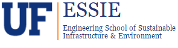
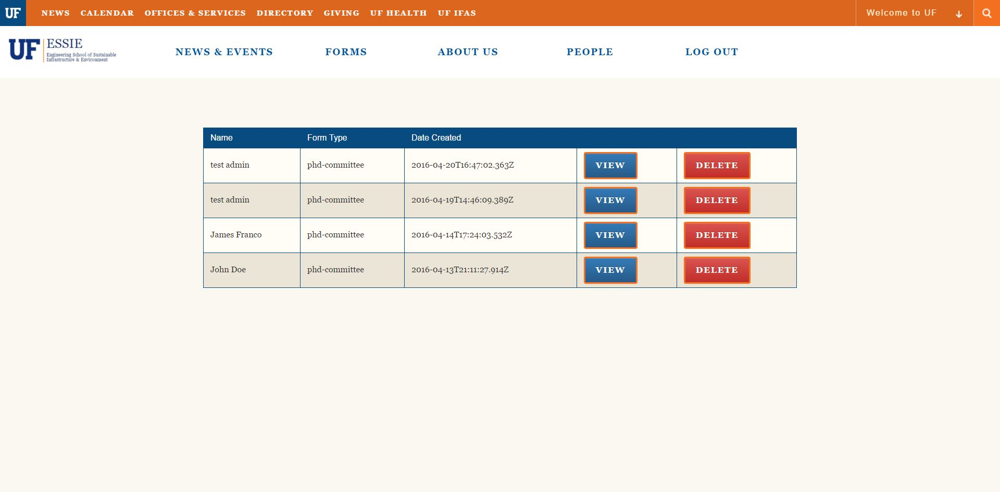

---
This Webapp has been designed for the University of Florida Environmental Engineering Department to streamline their form submission and record-keeping process.
---
***
[](http://meanjs.org/)

[](https://gitter.im/meanjs/mean?utm_source=badge&utm_medium=badge&utm_campaign=pr-badge&utm_content=badge)
[](https://travis-ci.org/meanjs/mean)
[](https://david-dm.org/meanjs/mean)
[](https://coveralls.io/github/meanjs/mean?branch=master)

MEAN.JS is a full-stack JavaScript open-source solution, which provides a solid starting point for [MongoDB](http://www.mongodb.org/), [Node.js](http://www.nodejs.org/), [Express](http://expressjs.com/), and [AngularJS](http://angularjs.org/) based applications. The idea is to solve the common issues with connecting those frameworks, build a robust framework to support daily development needs, and help developers use better practices while working with popular JavaScript components.

***
## Before You Begin
Before you begin we recommend you read about the basic building blocks that assemble a MEAN.JS application:
* MongoDB - Go through [MongoDB Official Website](http://mongodb.org/) and proceed to their [Official Manual](http://docs.mongodb.org/manual/), which should help you understand NoSQL and MongoDB better.
* Express - The best way to understand express is through its [Official Website](http://expressjs.com/), which has a [Getting Started](http://expressjs.com/starter/installing.html) guide, as well as an [ExpressJS Guide](http://expressjs.com/guide/error-handling.html) guide for general express topics. You can also go through this [StackOverflow Thread](http://stackoverflow.com/questions/8144214/learning-express-for-node-js) for more resources.
* AngularJS - Angular's [Official Website](http://angularjs.org/) is a great starting point. You can also use [Thinkster Popular Guide](http://www.thinkster.io/), and the [Egghead Videos](https://egghead.io/).
* Node.js - Start by going through [Node.js Official Website](http://nodejs.org/) and this [StackOverflow Thread](http://stackoverflow.com/questions/2353818/how-do-i-get-started-with-node-js), which should get you going with the Node.js platform in no time.

***
## Mean-Install-Guide
Make sure you have installed all of the following prerequisites on your development machine:
* Setup Git

	1) Download the Git installer here (http://www.git‐scm.com/downloads) and choose the default values.

	2) Open up a shell (Windows users, open up the newly installed Git Bash), and set your Name and Email:

    ```bash
    git config ‐‐global user.name “ YOUR NAME ”
    git config ‐‐global user.email “ YOUR_EMAIL
    ```

* Node.js - [Download & Install Node.js](https://nodejs.org/en/download/) and the npm package manager. If you encounter any problems, you can also use this [GitHub Gist](https://gist.github.com/isaacs/579814) to install Node.js.
  * __Node v5.3 or older IS NOT SUPPORTED AT THIS TIME!__

  a) Mac OSX / Linux users: Follow these steps:

	* Make a new global npm folder in your home (Or somewhere else that is owned by your user)

	* mkdir ~/.npm_global

	* Set the npm global prefix to that folder

	* npm config set prefix ‘ ~/.npm_global ‘

	* Add the new npm global folder to the PATH by adding the following line into your
	~/.bash_profile or ~/.profile file (If it doesn’t exist, create it)

	* export PATH=~/.npm_global/bin:$PATH

	* Ubuntu/Debian users: Make sure that the version of nodejs that you are installing is v5.3.0 or
	above. Follow these instructions to add a repository with the updated version of node

		```
		 $ curl -sL https://deb.nodesource.com/setup_5.x | sudo -E bash
		 $ sudo apt-get install -y nodejs build-essential
		```
	Linux users: npm might not be bundled with nodejs (check with npm --version). If so, use your
	favorite package manager to install npm.

* MongoDB - [Download & Install MongoDB](http://www.mongodb.org/downloads), and make sure it's running on the default port (27017).
* Ruby - [Download & Install Ruby](https://www.ruby-lang.org/en/documentation/installation/)

	a) Windows users, Make sure to install Ruby into your PATH. (An option in the installer)

	b) Mac OSX users, Ruby is already installed on your system (test this by running ruby ‐‐version in a
	terminal window)

	c) Linux users, we recommend using RVM ( https://rvm.io/ ) since it doesn’t require root privileges, but
	feel free to use your package manager as well.

* Bower - You're going to use the [Bower Package Manager](http://bower.io/) to manage your front-end packages. Make sure you've installed Node.js and npm first, then install bower globally using npm:

```bash
$ npm install -g bower
```

* Grunt - You're going to use the [Grunt Task Runner](http://gruntjs.com/) to automate your development process. Make sure you've installed Node.js and npm first, then install grunt globally using npm:

```bash
$ npm install -g grunt-cli
```

* Sass - You're going to use [Sass](http://sass-lang.com/) to compile CSS during your grunt task. Make sure you have ruby installed, and then install Sass using gem install:

```bash
$ gem install sass
```

```bash
$ npm install -g grunt-cli
```

* Gulp - (Optional) You may use Gulp for Live Reload, Linting, and SASS or LESS.

```bash
$ npm install gulp -g
```

***
## Post Mean-Install Guide
If you haven't already gone through the Mean-Install Guide, please do that first.

1)	Go into your terminal and clone the github repo by:
```
$ git clone https://github.com/CEN3031-Essie/Essie.git
```

This will create a folder called Essie that will contain all the files of the project and set up tracking to the repository.
If you want to ensure the remote is set up correctly you can type:
```
$ git remote –v
```
2)	In your terminal go to that folder and run:
```
$ npm install			 
```
This command does a few things:
* First it will install the dependencies needed for the application to run.
* If you're running in a development environment, it will then also install development dependencies needed for testing and running your application.
* Finally, when the install process is over, npm will initiate a bower install command to install all the front-end modules needed for the application

3)	Now your folder is all set up you need to make sure YOU can actually make changes to the GitHub. From the Mean-Install-Guide you’ll remember you set your global user.name and user.email. To see those again you can type in the terminal:

```
$ git config user.name
$ git config user.email
```

Knowing your user.email, your scrum master should contact the GitHub owner to set you up as a member/ owner based off your email so that you can make changes to the GitHub repository. You should be all set to go.

***
## Setting up your mongodb
If you haven't already signed up for a mongolab account, do so at www.mlab.com.
Once you do that, hit create new to create a new database.
you will most probably create an AWS single-node sandbox.
Give the database a name and create it.
Once it is created you should be able to see it under MongoDB Deployments on the homepage.
Navigate to that database and look for the MongoDB URI.
This URI is what you will use to connect your mean app to the mongoDB.
Copy that line and replace <dbuser> and <dbpassword> with your username and password (replace the <>'s too).
Within your ESSIE file folder, go to the folder path: config/env/development.js
On line 7 replace the comment "uri goes here" with the uri of your db contained in a string. You should be ready to go.

__NOTE__: This will not be the way to properly establish your mongo connection for final production. When doing it this way
your mongo uri is openly shown in your github. There are two solutions to this. One is to add your config/env/development.js
file to your .gitignore file so it will *not* be pushed to your gitHub. The other is to figure out the implementation of
environmental variables which is contained locally within your computer. Consult with the TA's about the best approach.
The method provided here is a simple means of getting started quicker.


***
## Running Your Application
After the install process is over, you'll be able to run your application using Grunt, just run grunt default task:

```
$ grunt
```
__NOTE__: If there are any stylistic errors contained with your code (eslint (line indentation) errors, css errors, etc.)
	running grunt will not work. You may however bypass it temporarily with:

```
$ grunt --force
```

That's it! Your application should be running. To proceed with your development, check the other sections in this documentation.
If you encounter any problems, try the Troubleshooting section.

__NOTE__: Your application should run on port 3000 with the *development* environment configuration, so in your browser just go to [http://localhost:3000](http://localhost:3000)

* explore `config/env/development.js` for development environment configuration options

***
## List of implemented features

+ UF 2015 CSS Template


+ List of implemented forms


+ Prepopulate form information with session variables
+ Prepopulate certain form fields with saved datasets


+ Submit forms to database


+ Email notification system for user submitted forms


+ Administrator authentication & security system
+ List of saved forms (administrator only)



+ Delete individual saved forms (administrator only)
+ View individual saved forms (administrator only)


***
## Credits/Borrowed Code
* Inspired by the great work of [Madhusudhan Srinivasa](https://github.com/madhums/)
* The MEAN name was coined by [Valeri Karpov](http://blog.mongodb.org/post/49262866911/the-mean-stack-mongodb-expressjs-angularjs-and)
* [Nodemailer](https://nodemailer.com/) was used to implement the email notification system (modules/forms/server/controllers/forms.server.controller.js)

***
## License
(The MIT License)

Permission is hereby granted, free of charge, to any person obtaining
a copy of this software and associated documentation files (the
'Software'), to deal in the Software without restriction, including
without limitation the rights to use, copy, modify, merge, publish,
distribute, sublicense, and/or sell copies of the Software, and to
permit persons to whom the Software is furnished to do so, subject to
the following conditions:

The above copyright notice and this permission notice shall be
included in all copies or substantial portions of the Software.

THE SOFTWARE IS PROVIDED 'AS IS', WITHOUT WARRANTY OF ANY KIND,
EXPRESS OR IMPLIED, INCLUDING BUT NOT LIMITED TO THE WARRANTIES OF
MERCHANTABILITY, FITNESS FOR A PARTICULAR PURPOSE AND NONINFRINGEMENT.
IN NO EVENT SHALL THE AUTHORS OR COPYRIGHT HOLDERS BE LIABLE FOR ANY
CLAIM, DAMAGES OR OTHER LIABILITY, WHETHER IN AN ACTION OF CONTRACT,
TORT OR OTHERWISE, ARISING FROM, OUT OF OR IN CONNECTION WITH THE
SOFTWARE OR THE USE OR OTHER DEALINGS IN THE SOFTWARE.
